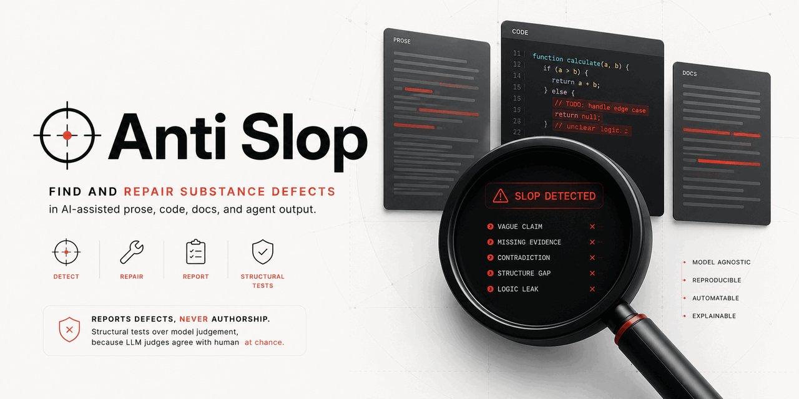
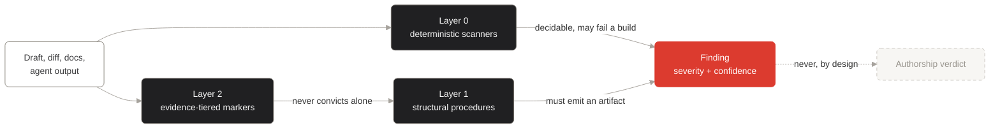
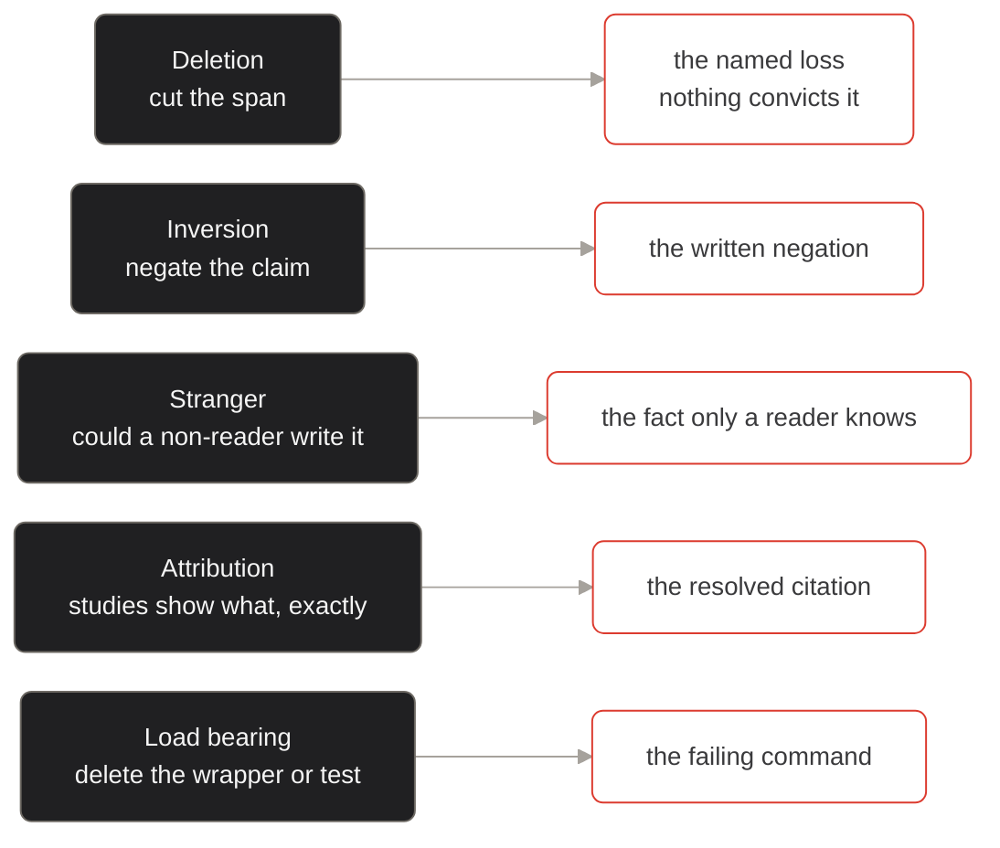

# anti-slop



Find and repair substance defects in AI-assisted prose, code, documentation,
and agent output.

It reports defects. It never reports authorship.

[](LICENSE)
[](LICENSE-CONTENT)

## Why this is not another AI detector or humanizer

Most tools in this space do one of two things, and both are broken.

**Detectors guess who wrote something.** They are unreliable and their failures
land on identifiable people. Sixteen detection models disproportionately
flagged English-language-learner essays, and non-White ELL students more than
White ELL peers, while human annotators on the same essays showed no
significant demographic bias (Stowe et al., ACL 2026). OpenAI withdrew its own
classifier at 26 percent true positive and 9 percent false positive.

**Humanizers strip the surface tells.** The Wikipedia guide that most of this
field derives from warns against exactly that, in bold:

> The patterns listed here are also only potential **signs** of a problem, not
> **the problem itself**. Please do not merely treat these signs as the
> problems to be fixed; that could just make detection harder.

The measurement agrees. "All humanizers tend to degrade the quality of the
original text": best-tier tools win a fluency comparison against the original
only 26.0 percent of the time (DAMAGE, COLING 2025).

**And you cannot just ask a model.** Agreement between LLM judges and human
slop labels is kappa 0.01 for GPT-5, minus 0.01 for DeepSeek-V3, and 0.03 for
o3-mini, which is chance (Shaib et al., arXiv 2509.19163). Worse, judges are
biased *toward* slop features: GPT-4 preferred model-written pitches 89 percent
of the time against human raters at 36 percent (PNAS 122(31)).

So this project never asks whether text "looks like" slop. Every check is a
mechanical procedure that emits an artifact you can inspect.

## How it works

Three layers, and only the bottom two may fail a build.



A marker never becomes a finding on its own. It routes to a procedure, and the
procedure has to produce something a person can check.

| Layer | What it is | May it fail a build |
|---|---|---|
| 0 | Deterministic scanners: residue, placeholders, references, dependencies, house voice | Yes, these are decidable |
| 1 | Structural procedures that emit a verifiable artifact | Yes, when a procedure convicts |
| 2 | Evidence-tiered signals: excess vocabulary, em dashes, burstiness | **Never alone.** They route to layer 1 |

### The five structural tests

Each test is a mechanical operation, and each one ends in an artifact rather
than an opinion.



| Test | Question | Artifact it must produce |
|---|---|---|
| Deletion | Cut the span. What was lost? | The cut span and the named loss. "Nothing" convicts it |
| Inversion | Negate the claim and write the negation out | If nobody would assert the negation, the original said nothing |
| Stranger | Could someone who never read the source write this? | The specific fact only a reader of the source would know |
| Attribution | Does "studies show" resolve to a source that supports *this* claim? | The resolved citation, or the finding |
| Load bearing | Delete the comment, wrapper, or assertion-free test. What broke? | The failing command, or nothing |

### The firewall

1. **Never emit an authorship verdict.** Defects, not origin.
2. **Never hard-fail on a stylistic marker alone.** Markers route to procedures.
3. **Severity is impact. Confidence is certainty.** Never merged.
4. **Never let the model gate its own repair.** The scanners re-run after a fix.

Rule 4 is not caution for its own sake: AI self-review gates drift into a
measured "rubber-stamp regime where acceptance scores rise while benchmark
correctness falls" (arXiv 2606.28438).

## What is in the box

```
anti-slop/
  anti-slop-plugin/     Claude Code plugin: 5 skills, 2 subagents, marker references,
                        and one PostToolUse hook (read SECURITY.md before installing)
  anti-slop-brain/      Obsidian knowledge base, scanners, adapters, tests
  research/             The verification ledger and the original research report
  docs/                 Design plan and release review
```

### anti-slop-plugin

| Skill | Does |
|---|---|
| `anti-slop` | Router. Picks the right leaf and explains the layers |
| `slop-review` | Read-only reviewer. Severity and confidence on separate axes |
| `slop-rewrite` | Repair pass. Consumes findings, never re-derives them |
| `slop-code` | Code and documentation surface |
| `slop-verify` | Citations, links, packages, residue |

### anti-slop-brain

| Piece | What |
|---|---|
| `wiki/` | 62 Markdown files: 58 content notes across concepts, markers, procedures, surfaces, detection, evidence, counterarguments, meta, questions and sources, plus 4 spine files (index, hot, log, overview) |
| `references/source-ledger.json` | 43 sources: 30 `primary`, 4 vendor, 3 supporting, 2 official, 2 practitioner, 1 authority, 1 regulator. Each carries a retrieval date, refresh date, evidence tier and stated limitations |
| `scripts/` | Six deterministic scanners plus two adapter lanes |
| `tests/` | 314 checks: 107 scanner, 207 adapter |

## Install

```bash
git clone https://github.com/AgriciDaniel/anti-slop.git
cd anti-slop
```

### Claude Code plugin

The plugin is five skills, two subagents and a hook. Symlinking the five skill
directories installs the skills only, and leaves out the subagents and the
hook. Link the **plugin directory**, once:

```bash
mkdir -p ~/.claude/skills
ln -s "$PWD/anti-slop-plugin" ~/.claude/skills/anti-slop
```

`mkdir -p` is not decoration. On a machine that has never created a personal
skill, `~/.claude/skills/` does not exist and `ln` fails with
`No such file or directory`.

Anything under `~/.claude/skills/<name>/` that contains a
`.claude-plugin/plugin.json`, as `anti-slop-plugin` does, loads as a plugin
named `<name>@skills-dir` on the next session, bringing its `skills/`,
`agents/` and `hooks/` with it. Confirm with `claude plugin list`. Validate
first if you like, with `claude plugin validate ./anti-slop-plugin`.

**Read [Security policy](SECURITY.md) before installing.** The bundled hook is
not scoped to this plugin's skills. It runs on every `Write` and `Edit` in
every session, in every project, for as long as the plugin is installed.

**Marketplace install.** `anti-slop-plugin/.claude-plugin/marketplace.json`
exists and points at this repository, so once the repository is public the path
is:

```bash
/plugin marketplace add AgriciDaniel/anti-slop
/plugin install anti-slop@anti-slop
```

The manifest's source is `git-subdir` on `anti-slop-plugin` at `main`, so a
marketplace install fetches the plugin subdirectory and not the brain. The
scanners live in the brain, so a marketplace install still needs this
repository cloned next to it for Layer 0 to work. The skills say so rather than
substituting judgement for a scanner.

**Uninstall.** Remove the symlink. The hook goes with it. Nothing was written
to `~/.claude/settings.json`.

### Scanners

Standard library only, no dependencies.

```bash
cd anti-slop-brain
python3 scripts/scan_residue.py path/to/file.md
python3 scripts/scan_refs.py path/to/file.md          # --online to resolve
python3 scripts/scan_packages.py path/to/project      # --online to check registries
```

The Obsidian vault is `anti-slop-brain/wiki/`. Open that folder directly.

**Scanner exit codes:** 0 clean, 1 findings, 2 usage error.

**`scan_refs` and `scan_packages` are offline by default.** Offline they check
shape and checksums only. An offline exit 0 must never be written up as
"references verified"; pass `--online` for that.

## What this does not claim

- It does not detect AI authorship, and is built so it cannot.
- It does not score writing quality holistically.
- It does not claim its marker lists are complete or durable. Vocabulary
  shifts by model generation, and human speech is converging on model
  vocabulary: delve up 48 percent, realm up 35 percent, adept up 51 percent
  within 18 months. Every marker carries an expiry date.
- It does not claim the AI-code-quality literature is settled. The
  methodologically strongest study is pre-registered with In-Principle
  Acceptance, and both of its phases have to be reported together: Phase 2, the
  pre-registered comparison, found **no significant differences**, while Phase
  1, observational, found the opposite direction, a **30.7 percent median
  reduction in completion time** with an AI assistant (Borg et al., arXiv
  2507.00788, a **preprint**, not a published paper; the In-Principle
  Acceptance was granted at ICSME). The strongest slop figures come from vendors
  selling engineering-intelligence products.
- It does not claim its own notes are free of the defects it describes, which
  is why the substance scorer runs against its own vault in CI.

Full register: `anti-slop-brain/wiki/counterarguments/What This Brain Does Not Claim.md`.

## Evidence discipline

Every numeric claim traces to an id in `references/source-ledger.json` carrying
a URL, retrieval date, evidence tier, and explicit limitations. Vendor sources
are marked, and a conflict of interest is recorded where the finding would sell
the vendor's product.

Count the ledger the strict way. It has 43 entries, of which **30 are
`source_type: "primary"`**. The ledger's `rules.accepted_primary_types` enum
also admits `vendor`, `official`, `regulator` and `authority`, which sums to
38, and an earlier version of this README quoted that 38 as the primary count.
That enum decides whether a source may be cited at all, not whether it is
independent, and reporting it as "primary" on the front page of a project whose
selling point is marking vendor conflicts was generous. The four vendor sources
are `pangram-supporting-evidence`, `gitclear-maintainability-gap`,
`gitclear-copilot-quality-2025` and `betterup-workslop`. None is tiered
`EVIDENCE-BASED`: three are `PRACTITIONER` and one is `FOLKLORE`, recorded so
the project can explain why it is not used rather than quietly dropping it.

`research/verification-ledger.md` records an adversarial pass over the research
base, including **eight corrections to figures the field repeats incorrectly**.
Two examples:

- The widely quoted Kobak prevalence of 10 and 30 percent comes from a
  **superseded preprint version**. The published figures in Science Advances
  are 13.5 and 40 percent. (The preprint was revised, not withdrawn; saying
  "withdrawn" would itself be a citation defect.)
- GitClear's 7.1 percent code churn is a **discarded projection**, never a
  measurement. The 2024 actual was 5.7 percent.

Where a source could not be read, that is recorded rather than guessed around.
Where a citation could not be resolved, the claim is blocked from deliverables
and filed as an open question rather than quietly dropped. See
`anti-slop-brain/wiki/questions/`.

## Contributing

Read [CONTRIBUTING.md](CONTRIBUTING.md) first. The rules are unusual and they
exist for reasons: every factual claim needs a ledger source with a real title
copied from the real document, markers may never convict alone, and every fix
needs a test verified to fail before the fix.

- [Code of conduct](CODE_OF_CONDUCT.md)
- [Security policy](SECURITY.md), including what counts as a firewall bypass
- [Support and where answers already live](SUPPORT.md)
- [Changelog](CHANGELOG.md)

The most valuable issue you can open is an **accuracy report**: a citation that
does not say what this project claims. There is a template for it, and it gets
priority.

## Licence

Split, because part of the content is copyleft and cannot be relicensed.

| Part | Licence |
|---|---|
| Code: scripts, tests, schemas | Apache 2.0, see [LICENSE](LICENSE) |
| Wikipedia-derived marker references | CC BY-SA 4.0 |
| Original prose and vault notes | CC BY 4.0 |

Details in [LICENSE-CONTENT](LICENSE-CONTENT), attribution in [NOTICE](NOTICE).

The marker taxonomy adapts
[Wikipedia:Signs of AI writing](https://en.wikipedia.org/wiki/Wikipedia:Signs_of_AI_writing)
(CC BY-SA 4.0). Adaptations of that material must stay under CC BY-SA 4.0.
[blader/humanizer](https://github.com/blader/humanizer) (MIT) was analysed as
prior art; no code or prose was copied.
