# Anti-Slop Brain

<p align="center">
  
</p>

Anti-Slop Brain is an evidence-gated Obsidian brain for detection and repair of AI slop in prose, code, documentation, and agent output, grounded in corpus evidence rather than authorship detection.

**This directory is a component of the [`anti-slop`](../README.md) repository,
not a standalone project.** Start at the repository root. Licence, changelog,
contributing rules, security policy and support all live there and govern this
directory too; the files in here point back to them rather than restating them.

**Current maturity: market-ready.** Verified 2026-07-28 by
`python3 scripts/audit_brain.py --json`, which returned score 100, status
`market-ready`, all eleven audit categories at 100, zero critical failures and
zero warnings. Re-run it rather than trusting this line. The audit is the
authority; this sentence is a dated snapshot of what it said.

It ships two artifacts:

- `assets/template-brain/` - the distributable Obsidian vault.
- `SKILL.md` plus `scripts/` - the agent-facing operating layer.

## Buyer

Writers, engineers, and agent operators who ship AI-assisted work and need a defensible, source-cited way to find and fix substance defects without accusing anyone of using AI.

## Outputs

- Findings report with severity and confidence on separate axes
- Structural test worksheet showing the artifact for each test
- Deterministic scan report
- Repair diff with re-scan evidence
- Marker cohort refresh log

## Quick Start

```bash
python -m pip install -e .
anti-slop-brain demo
anti-slop-brain lint --vault examples/sample-vault
anti-slop-brain report --vault examples/sample-vault --html-only
```

To create a client vault:

```bash
anti-slop-brain new acme --client-name "Acme Co" --owner "Daniel Agrici" --out-dir ~/anti-slop-brain-vaults
anti-slop-brain ingest --vault ~/anti-slop-brain-vaults/acme --file tests/fixtures/sample-source.md
anti-slop-brain synthesize --vault ~/anti-slop-brain-vaults/acme
anti-slop-brain visuals --vault ~/anti-slop-brain-vaults/acme
anti-slop-brain report --vault ~/anti-slop-brain-vaults/acme --html-only
anti-slop-brain next --vault ~/anti-slop-brain-vaults/acme
```

## Boundaries

V1 is advisory and read-only. It does not mutate accounts, systems, books,
pipelines, publishing tools, customer records, or live production data.

Domain claims are release-blocked until `references/current-requirements.md`,
`references/market-research.md`, `references/source-map.md`, and
`references/source-ledger.json` contain dated source material from trustworthy
sources. That gate is satisfied as of 2026-07-28: the ledger carries 43 dated
entries, each with a retrieval date, a refresh date, an evidence tier and
stated limitations, and none is past its refresh date.

## Maturity Gates

| # | Gate | Passed |
|---|---|---|
| 1 | Scaffolded: product shell, vault, source pack, scripts, tests, and demo exist | yes |
| 2 | Researched: dated trustworthy sources replace placeholder research | yes |
| 3 | Domain-adapted: real domain importer, synthesis, reports, fixtures, and tests exist | yes |
| 4 | Demo-verified: sample vault regenerates deterministically and reports cite sources | yes |
| 5 | Market-ready: audit score is at least 90 with no critical failures | yes, at 100 |

Scores are capped by maturity. A scaffold cannot become market-ready by edited
markdown alone, and this table cannot promote itself either. The gate that
counts is `scripts/audit_brain.py --require market-ready`.

## Research Policy

Use official, primary, or vendor documentation first. Use market or practitioner
sources only as supporting evidence. Do not treat blog roundups or AI summaries
as primary truth. Record evidence in `references/source-ledger.json`; prose-only
research notes do not satisfy the gate.

## Release

```bash
python scripts/package_release.py --version 0.1.0
python scripts/package_release.py --version 1.0.0 --release-type market-ready
```

Release packaging scans for secrets, local paths, symlinks, untracked drift,
and unsafe ZIP entries before writing `dist/RELEASE_MANIFEST.json` and
`dist/SHA256SUMS`. Market-ready packaging also runs `scripts/audit_brain.py`.
